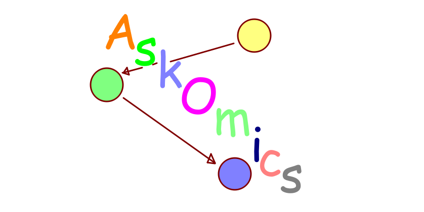
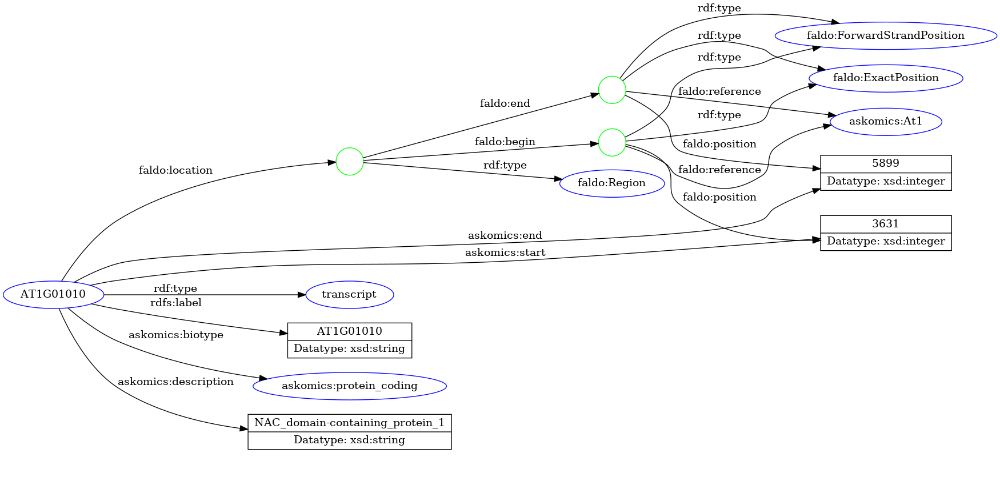
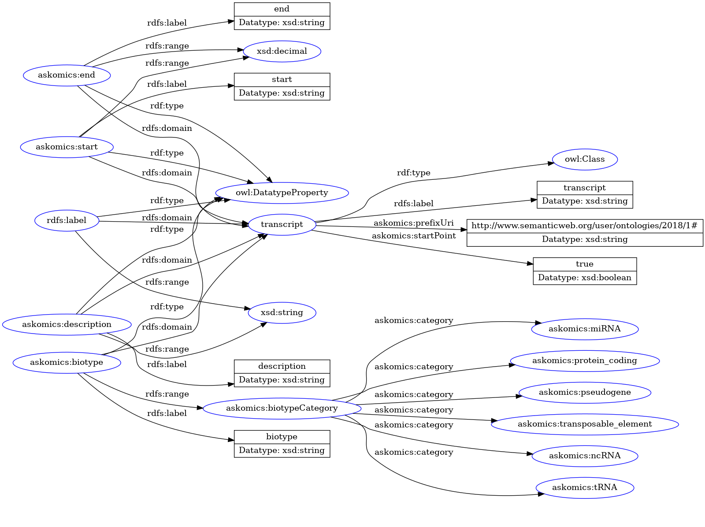

# AskOmics
-------------------------




.footnote[Xavier Garnier, Dyliss team, Inria]

---

## Table of contents
---------

1. Overview
    - Features
    - Development

2. AskOmics refactoring
    - Software architecture
    - Deployment in micro-services using with docker
    - Development tools
---


## Overview
---------

AskOmics is a Web tool to integrate datasets and query them through a graphical interface

- Integration: Convert TSV/CSV/GFF Data into RDF triples
- Query: Cross different data sources and extract information

User build a query through an interactive graph ⇒ User don’t need to know semantic web languages (RDF/SPARQL)

---


## Overview
### Features
#### Data integration
---------

During integration, user provides his biological data (TSV/CSV, GFF or BED) and AskOmics automatically detect what he wants to integrate


<iframe class="small-frame" src="integration_table.html"></iframe>


---


## Overview
### Features
#### Data integration
---------

Data are converted into RDF


- Content is the data
- Abstraction is a description of data (relation between entities, attributes ...)


---

## Overview
### Features
#### Data integration
---------




---

## Overview
### Features
#### Data integration
---------





---


## Overview
### Features
#### Query
---------

User explore his data using the graphical interface


Abstraction is requested to build the query graph and the category filters.

Content is requested to retrieve the results.


---

## Overview
### Features
#### Federated queries
---------

AskOmics can perform queries on external triplestores.

- AskOmics endpoints, using AskOmics abstraction
- External endpoints (Uniprot, DBpedia ...) using a local abstraction of the endpoint

A federated query engine decomposes the query into sub-queries and execute them on the proper endpoints.

---


## Overview
### Features
#### Federated queries
---------


---


## Overview
### Features
#### Galaxy
---------

AskOmics can be used with [Galaxy](https://galaxyproject.org/)

- Load galaxy datasets into AskOmics
- Save AskOmics results into a Galaxy dataset
- Save an AskOmics query into a Galaxy dataset

Galaxy can interact with AskOmics

- AskOmics tool to send datasets to AskOmics
- AskOmics interactive environment


---


## Overview
### Features
#### Galaxy
---------


---


## Overview
### Development
#### History
-------------


 <div include-html="timeline.html"></div> 


---


## Overview
### Development
#### Development issues
-------------

- <inline id="issues-number"></inline> open issues
- Dead code
- Deprecated js libraries
- Missing doc
- Slow
- Errors are not reported
- No coding guidelines

<div class="box box-info">
    <p>Redesign needed!</p>
<div>


---


## AskOmics 3
-------------

---

## AskOmics 3
### Software architecture
#### Frontend
-------------
Frontend is build with [React](https://reactjs.org/), a JavaScript library for user interface.

It build encapsulated components that manage their own state.

```javascript
class HelloMessage extends React.Component {
  render() {
    return (
      <div>
        Hello {this.props.name}
      </div>
    )
  }
}
```

```html
<HelloMessage name="Monsieur X" />
```

- JavaScript ES6 (classes, arrow functions, ...)
- JSX syntax

---

## AskOmics 3
### Software architecture
#### Backend
---------------

Backend is build with [Flask](http://flask.pocoo.org/), a python microframework

"Micro" mean keep the core simple, but extensible.

```python
from flask import Flask
app = Flask(__name__)

@app.route("/")
def hello():
    return "Hello World!"
```

---

## AskOmics 3
### Software architecture
#### Backend
---------------

The view route (`/`) render a html template

```python
@app.route('/')
def home():
    return render_template('index.html')
```
The html template have the js code of AskOmics

```html
<!DOCTYPE html>
<html lang="en">
  <head>
   <!--  ...  -->
  </head>
  <body>
    <div id="app"></div>
    <script src="{{url_for('static', filename='js/askomics.js')}}"></script>
  </body>
</html>
```

---

## AskOmics 3
### Software architecture
#### Backend
---------------

API routes (`/api/something`) render json

```python
@query_bp.route('/api/query/startpoints', methods=['GET'])
def query():
    try:
        tse = TriplestoreExplorer(current_app, session)
        startpoints = tse.get_startpoints()
    except Exception as e:
        current_app.logger.error(str(e))
        return jsonify({
            'startpoints': [],
            'error': True,
            'errorMessage': str(e)
        }), 500

    return jsonify({
        'startpoints': startpoints,
        'error': False,
        'errorMessage': ''
    })
```

---

## AskOmics 3
### Software architecture
#### Task queue
---------------

AskOmics use [Celery](http://www.celeryproject.org/), an open source asynchronous task queue.

Celery is used for long tasks (data integration and query)


---

## AskOmics 3
### Software architecture
#### Schema
---------------


---

## AskOmics 3
### Software architecture
#### Schema
---------------


---

## AskOmics 3
### Software architecture
#### Schema
---------------


---

## AskOmics 3
### Software architecture
#### Schema
---------------


---


## AskOmics 3
### Deployment
#### Manual
---------------

Install dependencies

- python3
- python3-venv
- npm
- redis
- [virtuoso-opensource](https://github.com/openlink/virtuoso-opensource)

Install AskOmics

```bash
# clone repo
git clone https://github.com/xgaia/flaskomics.git
cd flaskomics
# install (python + npm packages)
./install.sh
# run
./run_all.sh # -d dev
```

[localhost:5000](localhost:5000)

---


## AskOmics 3
### Deployment
#### Docker
---------------

We provide docker and docker-compose files to easily deploy AskOmics

```bash
# clone
git clone https://github.com/xgaia/flaskomics-docker-compose
cd flaskomics-docker-compose
# pull
docker-compose pull
# run
docker-compose up -d
# logs
docker-compose logs -f
# stop
docker-compose down
# upgrade
docker-compose down && docker-compose pull && docker-compose run -d
```


---


## AskOmics 3
### Development tools
#### Github
---------------

All sources are hosted on [Github](https://github.com/askomics)

[AskOmics 2](https://github.com/askomics/askomics)

[AskOmics 3](https://github.com/xgaia/flaskomics)

---

## AskOmics 3
### Development tools
#### CI
---------------

Continuous integration with [Travis-CI](https://travis-ci.org/xgaia/flaskomics) and [Coveralls](https://coveralls.io/github/xgaia/flaskomics)


Each PR have to pass the CI suite:

- Python code linting (flake8)
- Python unit testing (pytest)

Each PR have to increase the python code coverage


---

## AskOmics 3
### Development tools
#### Docs
---------------

Docs are written in `Docs` directory and automatically built with [readthedocs](https://readthedocs.io)

Docs of all version are available at [flaskomics.readthedocs.io](https://flaskomics.readthedocs.io)


---


## C4EST LA FIN
---------------
<br><br><br>
<center>
    <h1>
        <u>MERCI POUR VOTRE ATENTION §§§</u>  
    </h1>    
</center>

---


## EN FAIT NON
---------------
<br><br><br>
<center>
    <h2>
        QUIZ  
    </h2>    
</center>

---

## Quiz
---------------

- Comment est appeler les données nécessaire à la construction du graph d’interrogation des données ?

--


<div class="box box-info"><p><center>L'abstraction<center></p><div>


---

## Quiz
---------------

- Pour identifier un jeu de donnée publique, une icone représentant la terre est affiché. Mais quel continent la terre nous montre ?

--

 * <i class="fas fa-globe-europe"></i> L'Europe

 * <i class="fas fa-globe-asia"></i> L'Asie

 * <i class="fas fa-globe-americas"></i> L'Amérique

 * <i class="fas fa-globe-africa"></i> L'Afrique

--

<div class="box box-info">
    <p><center>
        <i class="fas fa-globe-europe"></i><i class="fas fa-globe-europe"></i><i class="fas fa-globe-europe"></i><i class="fas fa-globe-europe"></i><i class="fas fa-globe-europe"></i><i class="fas fa-globe-europe"></i><i class="fas fa-globe-europe"></i><i class="fas fa-globe-europe"></i><i class="fas fa-globe-europe"></i><i class="fas fa-globe-europe"></i><i class="fas fa-globe-europe"></i><i class="fas fa-globe-europe"></i><i class="fas fa-globe-europe"></i>
    L'Europe
    <i class="fas fa-globe-europe"></i><i class="fas fa-globe-europe"></i><i class="fas fa-globe-europe"></i><i class="fas fa-globe-europe"></i><i class="fas fa-globe-europe"></i><i class="fas fa-globe-europe"></i><i class="fas fa-globe-europe"></i><i class="fas fa-globe-europe"></i><i class="fas fa-globe-europe"></i><i class="fas fa-globe-europe"></i><i class="fas fa-globe-europe"></i><i class="fas fa-globe-europe"></i><i class="fas fa-globe-europe"></i>
    </center></p>
<div>

---

## Quiz
---------------

- Quelle est l’intérêt de Celery ?

--

  * Exécuter des taches automatiquement à intervalle régulier

  * Exécuter les tâches longue de façon asynchrone

  * Sa digestion consomme plus de calories que sa consommation n'en apporte<sup>*</sup>


\* Selon certaines source

--

<div class="box box-info"><p><center>Exécuter les tâches longue de façon asynchrone<center></p><div>


---


<br><br><br>
<center>
    <h1>
        VRAI FIN
    </h1>    
</center>

