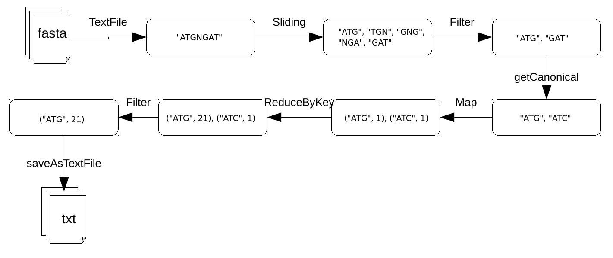

# DSparK
-------------------------

.footnote[Xavier Garnier, INRA]

---

## Table of contents
---------

1. dsk / GATB-core
2. DSparK
    - String kmers
    - Binary kmers
    - Dataframe

3. Benchmarks
    - Datasets

---


## dsk / GATB-core
------------------

DSK is a k-mer counter for reads or genomes. It use the GATB-core library (C++)

--
count: false

- input: set af sequences (fasta/q)
- output: set of kmers which occur more than a minimal amount of times, and number of times these kmers occur

output format is a binary file in h5 format. This output can converted to ascii with `dsk2ascii`

---
## dsk / GATB-core
------------------

A kmer and its reverse complement are considered to be the same kmer. DSK considers that A<C<T<G and returns the lexicographically smaller kmer using this alphabet order.


---
## DSparK
------------------


<b>D</b><b><i>S</i></b><i>par</i><b><i>K</i></b> is the spark implementation of dsk. It's available on the lipm GitLab.

- Code: https://lipm-gitlab.toulouse.inra.fr/spark-ics/DSparK
- Doc: https://lipm-gitlab.toulouse.inra.fr/spark-ics/DSparK/wikis/home


```bash
spark-submit --master yarn
             --deploy-mode cluster
             --num-executors 150
             --executor-memory 5G
             target/scala-2.11/DSparK-assembly-0.1.jar
                --input input_dir
                --kmer-size 31
                --abundance-max 2147483647
                --abundance-min 2
                --input-type fasta
                --output output_dir
```


* input: path to a fasta/q file, or a directory containing fasta/q files
* output: path to a directory that not exist

DSparK use [paramparser](https://lipm-gitlab.toulouse.inra.fr/llegrand/scala-utils)


---
## DSparK
### String kmers
------------------

First version of DSparK handle kmers in String Format





---
## DSparK
### Binary kmers
-----------------

The second version handle kmers in binary format (Long)


---
## DSparK
### Binary kmers
-----------------

DSparK encodes nucleotids the same way as GATB

```c
// GATB, C++
int nt2int(char nt) {
    return (nt >> 1 & 3);
}
```


```scala
// DSparK, Scala
def nuclToLong(nucl: Char): Long = {
    nucl >> 1 & 3
}
```


| Char | Int | Binary | nt2int (binary) | nt2int (int) |
|:---:|:---:|:---:|:---:|:---:|
| A | 65 | 1000<span style="color:red">00</span>1 | 00 | 0 |
| C | 67 | 1000<span style="color:red">01</span>1 | 01 | 1 |
| T | 84 | 1010<span style="color:red">10</span>0 | 10 | 2 |
| G | 71 | 1000<span style="color:red">11</span>1 | 11 | 3 |


---
## DSparK
### Binary kmers
-----------------

DSparK use a 64 bits `Long` to store the kmer. we can store a kmer with a maximum size of 32

Kmer and its revcomp are computed at the same time

The smallest `Long`  is the canonical one.


---
## DSparK
### Spark DataFrame
-----------------

A Dataframe is a distributed collection of data. It provides the benefits of RDDs (strong typing, ability to use powerful lambda functions) with the benefits of Spark SQL’s optimized execution engine.

---
## DSparK
### Implementations
-----------------

4 implementation of DSparK:

- String Kmers witk RDD
- String kmers with DF
- Binary kmers with RDD
- Binary kmers with DF


---
## Benchmarks
### Datasets
-----------------
Input files: 4 fasta files:

|File|Size|Number of reads|
|:-----:|:-----:|:-----:|
|ERR194146_1.fasta|127 G|813 180 578|
|ERR194146_2.fasta|127 G|813 180 578|
|ERR194147_1.fasta|122 G|787 265 109|
|ERR194147_2.fasta|122 G|787 265 109|

3 datasets:

|Dataset|Files|Size|Number of reads|
|:-----:|:-----:|:-----:|:-----:|
|DS1|ERR194146_1.fasta|127 G|813 180 578|
|DS2|ERR194146_1.fasta + ERR194146_1.fasta|254 G|1 626 361 156|
|DS3|all|497 G|3 200 891 374|


---
## Benchmarks
### DSK
-----------------

<div id="benchmark_dsk_histogram"></div>


---
## Benchmarks
### DSparK
-----------------

Comparison of the 4 implementations of DSparK, on DS2, with 150 executors


<div id="benchmark_spark_histogram"></div>


---
## Benchmarks
### DSparK
------------

Execution time of DSparK on the 3 datasets, in function of the number of executors.

<div id="spark_benchmark"></div>

---
## Benchmarks
### Comparison
------------

Comparison between DSK and DSparK (on DS2):
- With the same ressources (40 cores/executors)
- The best execution time (40 cores for DSK, 150 executors for DSparK)

<div id="comparison_benchmark"></div>


---
## Conclusion
------------

- Execution time

With equivalente resources, it's difficult to compete a C++ program, but with Spark, we can easily access more ressources.

- Developpment time

Spark programs are easily to developp (once learning time is done)


