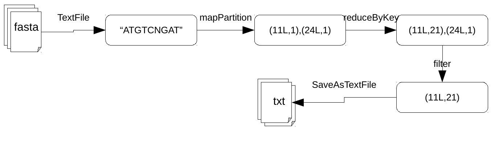
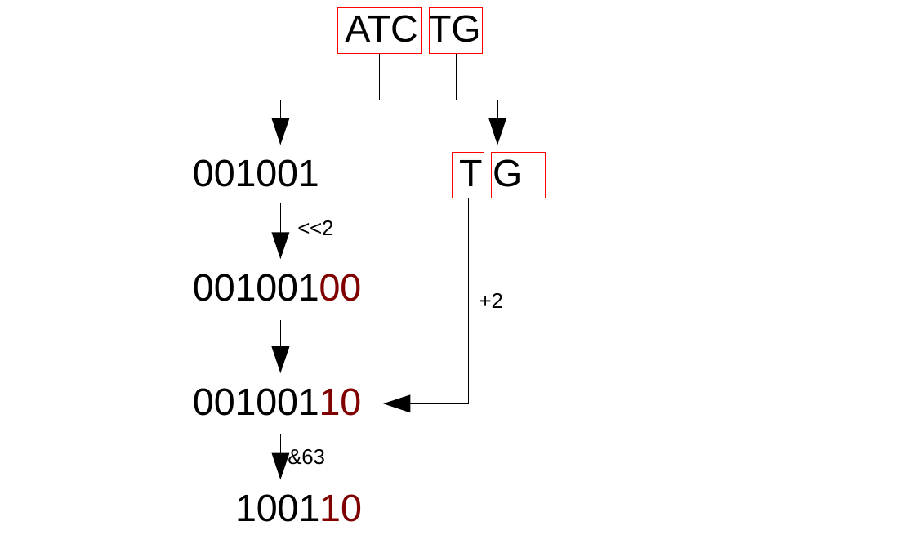

# DSparK
-------------------------

.footnote[Xavier Garnier, INRA]

---

## Table of contents
---------

1. dsk / GATB-core
2. DSparK
    - String kmers
    - Binary kmers
    - Dataframe

3. Conclusion

---


## dsk / GATB-core
------------------

DSK is a k-mer counter for reads or genomes. It use the GATB-core library (C++)

--
count: false

- input: set af sequences (fasta/q)
- output: set of kmers which occur more than a minimal amount of times, and number of times thses kmers occur

output format is a binary file in h5 format. This output can converted to ascii with `dsk2ascii`

---
## dsk / GATB-core
------------------

A kmer and its reverse complement are considered to be the same lmer. DSK considers that A<C<T<G and returns the lexicographically smaller kmer using this alphabet order.


---
## dsk / GATB-core
### Benchmark
------------------


Input files: 2 fasta files,
- number of reads : 800 000 000
- size : 254 GB

--
count: false

| Soft | Machine | cores | memory | disk | exec time |
|:---:|:---:|:---:|:---:|:---:|:---:|
| dsk | VM | 20 | 45G | 150G | 33 min |
| dsk | cluster | 40 | 100G | 500G | 24 min |


---
## DSparK
------------------


<b>D</b><b><i>S</i></b><i>par</i><b><i>K</i></b> is the spark implementation of dsk. It's available on the lipm GitLab.

- Code: https://lipm-gitlab.toulouse.inra.fr/spark-ics/DSparK
- Doc: https://lipm-gitlab.toulouse.inra.fr/spark-ics/DSparK/wikis/home


```bash
spark-submit --master yarn
             --deploy-mode cluster
             --num-executors 150
             --executor-memory 5G
             target/scala-2.11/DSparK-assembly-0.1.jar
                --input input_dir
                --kmer-size 31
                --abundance-max 2147483647
                --abundance-min 2
                --input-type fasta
                --output output_dir
```


* input: path to a fasta/q file, or a directory containing fasta/q files
* output: path to a directory that not exist

DSparK use [paramparser](https://lipm-gitlab.toulouse.inra.fr/llegrand/scala-utils)


---
## DSparK
### String kmers
------------------

First version of DSparK handle kmers in String Format


---
## DSparK
### String kmers
#### Benchmark
------------------


| Soft | Machine | cores | memory | disk | exec time |
|:---:|:---:|:---:|:---:|:---:|:---:|
| dsk | VM | 20 | 45G | 150G | 33 min |
| dsk | cluster | 40 | 100G | 500G | 24 min |
| DSparK1 | spark | 150 | 5G/executor | -- | 49 min |


---
## DSparK
### Binary kmers
-----------------

The second version handle kmers in binary format (Long)





---
## DSparK
### Binary kmers
-----------------

DSparK encodes nucleotids the same way as GATB

```c
// GATB, C++
int nt2int(char nt) {
    return (nt >> 1 & 3);
}
```


```scala
// DSparK, Scala
def nuclToLong(nucl: Char): Long = {
    nucl >> 1 & 3
}
```


| Char | Int | Binary | nt2int (binary) | nt2int (int) |
|:---:|:---:|:---:|:---:|:---:|
| A | 65 | 1000<span style="color:red">00</span>1 | 00 | 0 |
| C | 67 | 1000<span style="color:red">01</span>1 | 01 | 1 |
| T | 84 | 1010<span style="color:red">10</span>0 | 10 | 2 |
| G | 71 | 1000<span style="color:red">11</span>1 | 11 | 3 |


---
## DSparK
### Binary kmers
-----------------

DSparK use a 64 bits `Long` to store the kmer. we can store a kmer with a maximum size of 32




---
## DSparK
### Binary kmers
-----------------


Kmer and its revcomp are computed at the same time

The smallest `Long`  is the canonical one.


---
## DSparK
### Binary kmers
#### Benchmark
-----------------


| Soft | Machine | cores | memory | disk | exec time |
|:---:|:---:|:---:|:---:|:---:|:---:|
| dsk | VM | 20 | 45G | 150G | 33 min |
| dsk | cluster | 40 | 100G | 500G | 24 min |
| DSparK1 | spark | 150 | 5G/executor | -- | 49 min |
| DSparK2 | spark | 150 | 5G/executor | -- | 46 min |

Still less efficient than GATB

---
## DSparK
### Spark DataFrame
-----------------

A Dataframe is a distributed collection of data. It provides the benefits of RDDs (strong typing, ability to use powerful lambda functions) with the benefits of Spark SQL’s optimized execution engine.


---
## DSparK
### Spark DataFrame
#### Benchmark
-----------------


| Soft | Machine | cores | memory | disk | exec time |
|:---:|:---:|:---:|:---:|:---:|:---:|
| dsk | VM | 20 | 45G | 150G | 33 min |
| dsk | cluster | 40 | 100G | 500G | 24 min |
| DSparK1 | spark | 150 | 5G/executor | -- | 49 min |
| DSparK2 | spark | 150 | 5G/executor | -- | 46 min |
| DSparK23 | spark | 150 | 5G/executor | -- | **24 min** |


---
## Conclusion
------------


