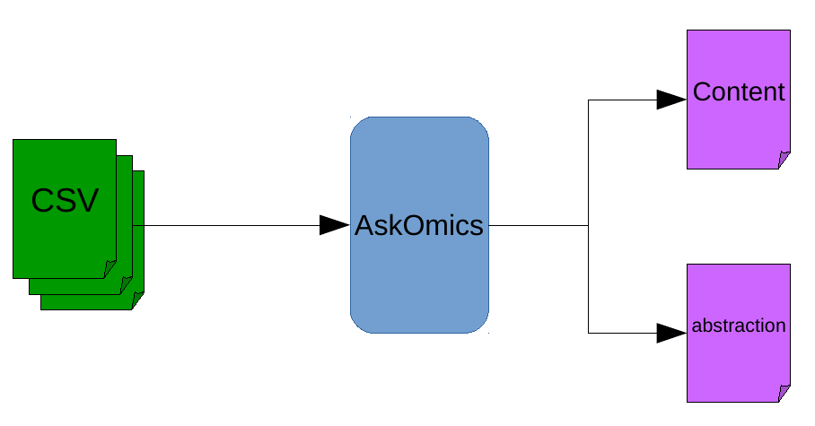
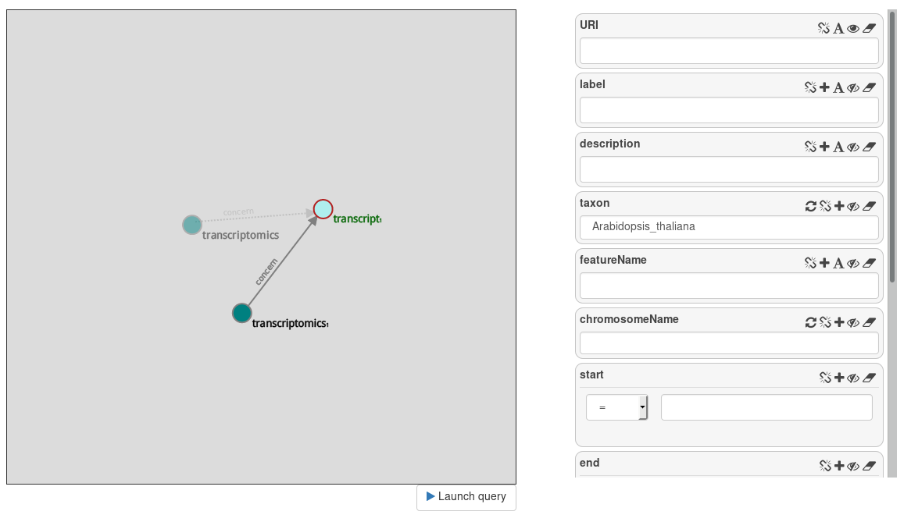
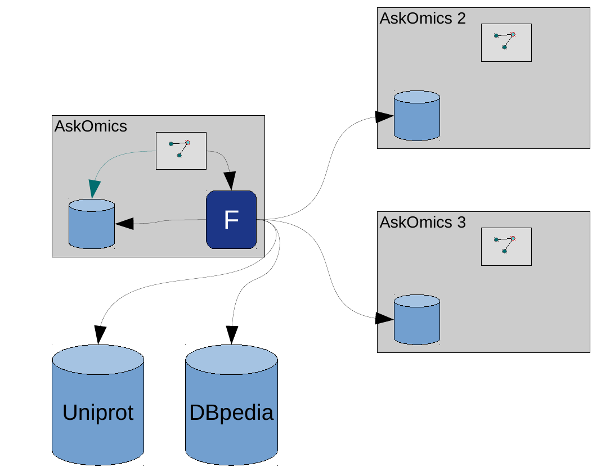
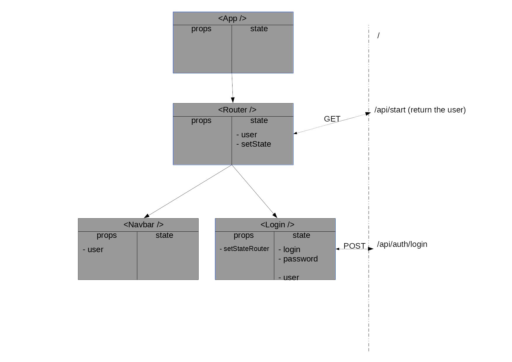
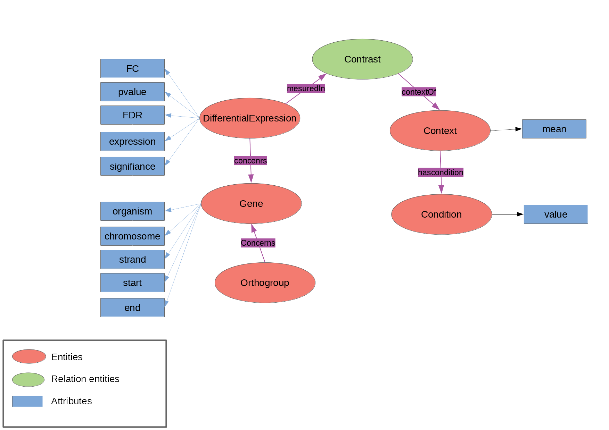
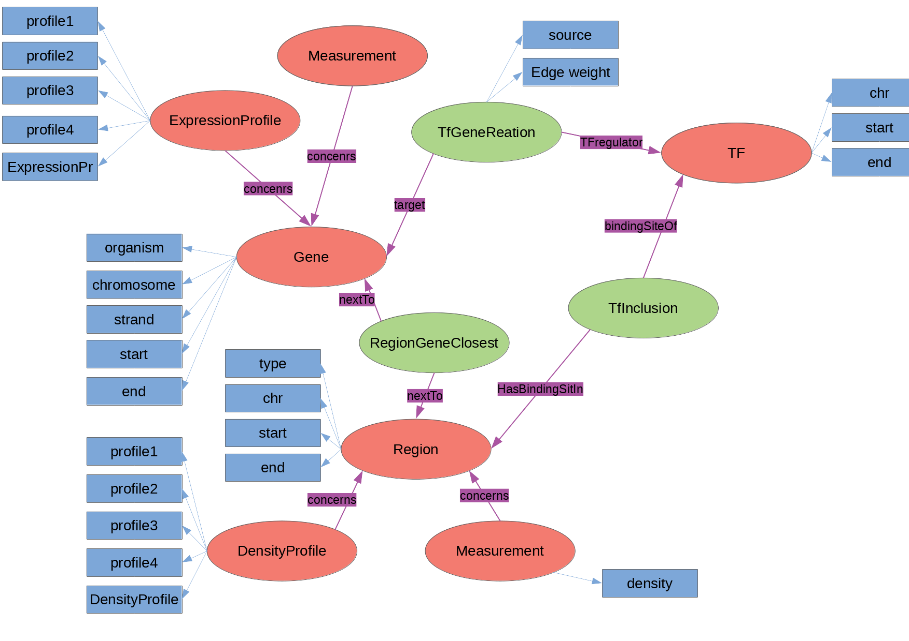
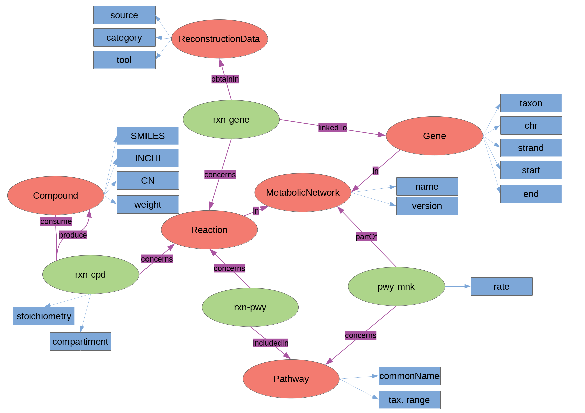
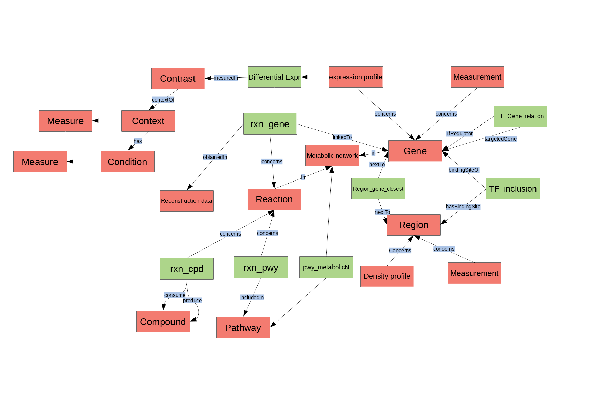

# AskOmics
-------------------------

.footnote[Xavier Garnier, Dyliss team, Inria]

---

## Table of contents
---------

1. Overview
    - Integration
    - Query
    - federated queries
    - Galaxy interactions

2. Software architecture
    - Backend - Python, Pyramid framework
    - Frontend - Javascript, jquery

3. Refactoring
    - Backend - Python, Flask framework
    - Frontend - Javascript, react

4. Data schema
    - Brassica expression profile
    - Human expression profile
    - Algue metabolic network

---


## Overview
---------

AskOmics is a Web tool to integrate datasets and query them through a graphical interface

- Integration: Convert TSV/CSV/GFF Data into RDF triples
- Query: Cross different data sources and extract information

User build a query through an interactive graph ⇒ User don’t need to know semantic web languages (RDF/SPARQL)

---


## Overview
### Integration
---------

During integration, user provides his biological data (TSV/CSV, GFF or BED) and AskOmics automatically detect what he wants to integrate


<iframe class="small-frame" src="integration_table.html"></iframe>


---


## Overview
### Integration
---------

Data are converted into RDF



- Content is the data
- Abstraction is a description of data (relation between entities, attributes ...)


---

## Overview
### Integration
---------

```ttl
:AT1G01010 rdf:type :transcript ;
           rdfs:label "AT1G01010"^^xsd:string ;
           askomics:position_taxon askomics:Arabidopsis_thaliana ;
           askomics:featureName "NAC001"^^xsd:string ;
           askomics:position_ref askomics:At1 ;
           askomics:position_start 3631 ;
           askomics:position_end 5899 ;
           askomics:featureType askomics:gene ;
           askomics:position_strand askomics:plus ;
           askomics:biotype askomics:protein_coding ;
           faldo:location [ a faldo:Region ;
                            faldo:begin [ a faldo:ExactPosition;
                                          a faldo:ForwardStrandPosition;
                                          faldo:position 3631;
                                          faldo:reference askomics:At1 ;
                                              ];
                            faldo:end [ a faldo:ExactPosition;
                                        a faldo:ForwardStrandPosition;
                                        faldo:position 5899;
                                        faldo:reference askomics:At1;
                                            ]] .
```

---

## Overview
### Integration
---------


```ttl
:transcript rdf:type owl:Class ;
           askomics:entity "true"^^xsd:boolean ;
           rdfs:label "transcript"^^xsd:string .

askomics:featureName askomics:attribute "true"^^xsd:boolean .
                     askomics:attributeOrder "3"^^xsd:decimal .
                     rdf:type owl:DatatypeProperty ;
                     rdfs:label "featureName"^^xsd:string ;
                     rdfs:domain :transcript ;
                     rdfs:range xsd:string .

askomics:featureType askomics:attribute "true"^^xsd:boolean .
                     askomics:attributeOrder "7"^^xsd:decimal .
                     rdf:type owl:DatatypeProperty ;
                     rdfs:label "featureType"^^xsd:string ;
                     rdfs:domain :transcript ;
                     rdfs:range askomics:featureTypeCategory .

askomics:featureTypeCategory askomics:category askomics:miRNA_gene , 
                               askomics:tRNA_gene , 
                               askomics:gene , 
                               askomics:pseudogene , 
                               askomics:ncRNA_gene .
```


---


## Overview
### Query
---------

User explore his data using the graphical interface




Abstraction is requested to build the query graph and the category filters.

Content is requested to retrieve the results.


---

## Overview
### Federated queries
---------

AskOmics can perform queries on external triplestores.

- AskOmics endpoints, using AskOmics abstraction
- External endpoints (Uniprot, DBpedia ...) using a local abstraction of the endpoint

A federated query engine decompose the query into sub-queries and execute them on the proper endpoints.

---


## Overview
### Federated queries
---------




---


## Overview
### Galaxy integrations
---------

AskOmics can be used with [Galaxy](https://galaxyproject.org/)

- Load galaxy datasets into AskOmics
- Save AskOmics results into a Galaxy dataset
- Save an AskOmics query into a Galaxy dataset

Galaxy can interact with AskOmics

- AskOmics tool to send datasets to AskOmics
- AskOmics interactive environment


---


## Software architecture
-------------

---

## Software architecture
-------------


AskOmics is composed of 3 part

- Backend: [Pyramid](https://trypyramid.com) framework
- Frontend: Javascript ([jquery](https://jquery.com) + [d3.js](https://d3js.org))
- Triplestore


---


## Software architecture
### Backend
-------------

[http://localhost:6543](http://localhost:6543)


`__init__.py`
```python
def main(global_config, **settings):
    """ This function returns a Pyramid WSGI application."""
    config.add_route('home', '/')
```

`views.py`
```python
@view_config(route_name='home', renderer='static/src/templates/index.pt')
def my_view(request):
    return {'project': 'Askomics'}
```

`static/src/templates/index.pt`
```html
<script>
    new IHMLocal().start();
</script>
```

---


## Software architecture
### Frontend
-------------


```html
<button class="btn btn-default"  id="starter" onclick="__ihm.startSession();">Start</button>
```
Or

```javascript
$("#starter").on('click', function(d) {
  // do something
});
```


---


## Software architecture
### Frontend
-------------

`.js`
```javascript
login(username, password){

    let service = new RestServiceJs('login');

    let model = {
      'username': username,
      'password': password
    };

    service.post(model, (data) => {
        this.username = data.username;
        this.admin = data.admin;
        this.blocked = data.blocked;
        this.galaxy = data.galaxy;
    });
}
```

---

## Software architecture
### Frontend
-------------
`__init__.py`
```python
config.add_route('login', '/login')
```

`ask_view.py`
```python
@view_config(route_name='login', request_method='POST')
def login(self):
    # ...
    return {
        'username': username,
        'admin': admin,
        'blocked': blocked,
        'galaxy': galaxy,
    }
```

---

## Software architecture
### Frontend
-------------
[handlebars](http://handlebarsjs.com/) templating

`.js`
```javascript
function displayTSVForm(file) {

    let template = AskOmics.templates.csv_form;
    let context = {idfile: getIdFile(file),file: file, admin: admin};
    let html = template(context);
    $("#content_integration").append(html);
}
```

`static/src/templates/handlebars/csv_form.hbs`
```handlebars
{{#each file.headers}}
    <th class='column_header'>
        {{#unless @first}}
            <input type='checkbox' class='toggle_column_present' checked />
        {{/unless}}
        <input class='header-text' value="{{this}}"></input>

    </th>
{{/each}}
```

---

## Refactoring
---------------


Lot of problems with the actual version

- Lot of bugs (<inline id="issues-number"></inline> open issues)
- Dead code
- Deprecated js libraries
- Missing doc

=> Need a complete redesign:


---


## Refactoring
### Backend
---------------

[Flask](http://flask.pocoo.org/) is a python microframework

"Micro" mean keep the core simple, but extensible.

```python
from flask import Flask
app = Flask(__name__)

@app.route("/")
def hello():
    return "Hello World!"
```

---

## Refactoring
### Backend
---------------

The view route (`/`) render a html template

```python
@app.route('/')
def home():
    return render_template('index.html')
```
The html template have the js code of AskOmics

```html
<!DOCTYPE html>
<html lang="en">
  <head>
   <!--  ...  -->
  </head>
  <body>
    <div id="app"></div>
    <script src="{{url_for('static', filename='js/askomics.js')}}"></script>
  </body>
</html>
```

---

## Refactoring
### Backend
---------------

API routes (`/api/something`) render json

```python
@app.route('/api/auth/login', methods=['POST'])
def login():
    data = request.get_json()

    local_auth = LocalAuth(app, session)
    authentication = local_auth.authenticate_user(data)

    if not authentication['error']:
        session['user'] = authentication['user']

    return jsonify({
        'error': authentication['error'],
        'errorMessage': authentication['error_messages'],
        'user': authentication['user']
        })
```

---

## Refactoring
### Frontend
---------------

[React](https://reactjs.org/) is a JavaScript library for user interface. It build encapsulated components that manage their own state.

```javascript
class HelloMessage extends React.Component {
  render() {
    return (
      <div>
        Hello {this.props.name}
      </div>
    )
  }
}

ReactDOM.render(
  <HelloMessage name="Taylor" />,
  document.getElementById('hello-example')
)
```

- JavaScript ES6 (classes, arrow functions, ...)
- JSX syntax

---

## Refactoring
### Frontend
---------------

A component is a class who contains:

- props (properties) : immutable property of a component
- state : the state of the component

- a `constructor` (define the initial state)
- specific methods
    - `componentDidMount` (executed when a component is mounted)
    - `componentWillUnmout` (executed before a component is destroyed)
- a `render` method (render html using jsx syntax)


To change the state of a component, use the `setState()` method. When the state change, all the component using the states are re-rendered.


---

## Refactoring
### Frontend
---------------




---


## Refactoring
### Frontend
---------------

[Demo](http://localhost:5000)


---

## Data Schema
---------------


---


## Data Schema
### Brassica expression
---------------





---


## Data Schema
### Human expression
---------------





---


## Data Schema
### Metabolic network
---------------





---

## Data Schema
---------------



---
