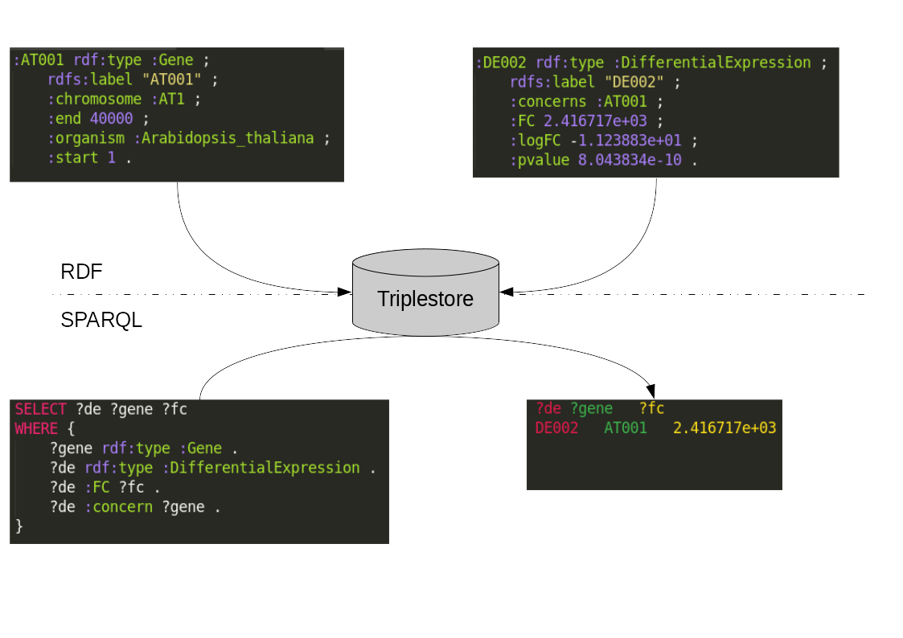
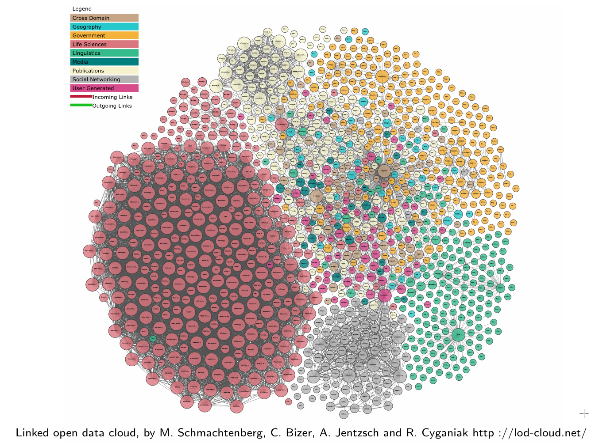

# Jobim 2019
-------------------------

<br><br><br>
<center>
    <h3>
        AskOmics, a collaborative user-friendly interface for integrating datasets with references resources using semantic web technologies 
    </h3>    
</center>

<br><br><br><br><br>
<center>
<small>
    Xavier Garnier<sup>1</sup>, Anthony Bretaudeau<sup>1,2</sup>, Fabrice Legeai<sup>1,2</sup>, Anne Siegel<sup>1</sup> and Olivier Dameron<sup>1</sup>
</small>
</center>

<br><br><br>


<small>
1. Inria, Univ Rennes, CNRS, IRISA<br/ >
2. INRA, UMR IGEPP, BIPAA<br/ >

</small>

---

## Outline
---------

1. The nightmare of data: how to integrate project data with reference datasets

2. AskOmics as a solution

3. Demo

4. What's next?


---


## The nightmare of data
---------

--

Big Data: Datasets so **large** or **complex** that traditional data processing is inadequate.


- More than 1500 databases, lack of interoperability, multiple file format
- Need to integrate public data and project specific data
- Integration and query require technical skills and time

Need a user-friendly interface for data integration and querying


---

## The nightmare of data
### How to explore data
---------


---


## The nightmare of data
### The semantic web
---------

- RDF (resource description framework) can well describe entities and relations

```
:gene rdf:type owl:Class .
:chromosome rdf:type owl:ObjectProperty .
:chromosome rdfs:domain :Gene .

:AT001 rdf:type :Gene ;
       rdfs:label "AT001" ;
       :chromosome :AT1 ;
       :end 40000 ;
       :organism :Arabidopsis_thaliana ;
       :start 100 .
```
--

- SPARQL (SPARQL protocol and query language) can be used to extract information

```
SELECT ?gene ?label
WHERE {
    ?gene rdf:type :Gene .
    ?gene rdfs:label ?label .
}

```

---


## The nightmare of data
### The semantic web
---------



---


## The nightmare of data
### The semantic web
---------




---


## AskOmics as a solution
---------

--

AskOmics is a web software for data integration (references data and project specific data) and query using semantic web

- Convert multiple data format into rdf triples, and store them into a triplestore

- Query the rdf graph using a user-friendly interface

- Save, relaunch and share queries and results with other users (AskOmics is multi-users)

- AskOmics ecosystem: tools to generate AskOmics compliant files (AskoR, AuReMe), Interoperability with Galaxy


---

## Demo
### Input files
---------

--

- Genetic files
    * *Arabidopsis thaliana* (GFF, TAIR)
    * *Brassica napus* genes (GFF, BBIP platform)
    * Orthology relation (TSV, Chalhoub *et al*, 2014)

- Differential expression
    * Differential expression of *Brassica napus* genes between roots and leaves  (TSV, EdgeR + AskoR)

- Pathway
    * genes reaction and pathway data of *Brassica napus* (TSV, Metacyc + AuReMe)


---


## Demo
---------


<br>
<center>
    <h3>
        C4EST PARTI POUR LA <a href="http://localhost:6543">D2MO</a> §§§
    </h3>    
</center>


---


## Demo
### Biological questions
---------

- Which genes of *Brassica napus* are more strongly expressed in the roots than in the leaves?

--

- What are their orthologs in *Arabidospis thaliana*? Are they in a QTL?

--

- In which biological reactions are the genes obtained involved, and in which metabolic pathways are they involved?

---


## What's next?
### Ongoing work
---------

--
- Improve reproducibility and sharing functionalities

    - Save and share queries
    - Automated integration and query with the API


--

- Reach a larger user base
    - Offer a library of templates (TSV headers)
    - Provides query templates

--

- Extend query expressivity (and/or
)

--


- Support for multiple endpoints (FederatedQueryScaler, wimmics)

--


- Refactoring interface

    - API: Flask microframework (python)
    - Task queue: Celery (python)
    - Front: React library (JS)


---


## Collaboration
---------

Thanks to all AskOmics users:

- C Bettembourg – IGEPP aphids (D. Tagu)
- A. Evrard – IGEPP rapeseed (M. Jubault)
- M.Aite/C.Frioux/A.Siegel AUREME
- C.Bettembourg - Sanofi
- P. Leroux/F.Lecerf/S.Lagarrigue (Metachick, metabolome)
- IFB project (CIRAD/INRA) - Connecting AskOmics with ”SouthGreen” endpoint
- M. Rousseau/J.Lucas/J.Ferreira de Carvalho/S.Knosp - Rapeseed
- A. Sarniguet,J.Chappat - Rhysophere Colza
- M. Louarn Hematology
- M. Conan Seaweed
- L. Guillot-Cloarec Uniprot/NextProt
- S. Daval (INRA) - Meta-transcriptomics
- BIPAA (Arthropodes)/BBIP (Rapeseed) endpoint in production mode
- M. Wery these CIFRE - Sanofi
- M. Louarn these INSERM-INRIA
- J. Yon - Pegase, INRA
- M. Gonzalez - CGR, Universidad de Chile
- O. Chakoory/E. Forano - INRA
- G. Rabut - IGDR - protein-protein interactions
- P. Baudier/M. Aite - Drugs repositioning
- V. Henry - Neuromarkers


---

## Usefull links
---------

- Github repos
    - AskOmics: [askomics/askomics](https://github.com/askomics/askomics)
    - AskOmics3: [xgaia/flaskomics](https://github.com/xgaia/flaskomics)

- Docs:
    - AskOmics: [askomics.readthedocs.io](https://askomics.readthedocs.io)
    - AskOmics3: [flaskomics.readthedocs.io](https://flaskomics.readthedocs.io)


- Running instance: [askomics.genouest.org](https://askomics.genouest.org)

- This slides: [xgaia.github.io/askomics/jobim/2019](https://xgaia.github.io/askomics/jobim/2019)

- Contact me: [xavier.garnier@irisa.fr](mailto:xavier.garnier@irisa.fr)

