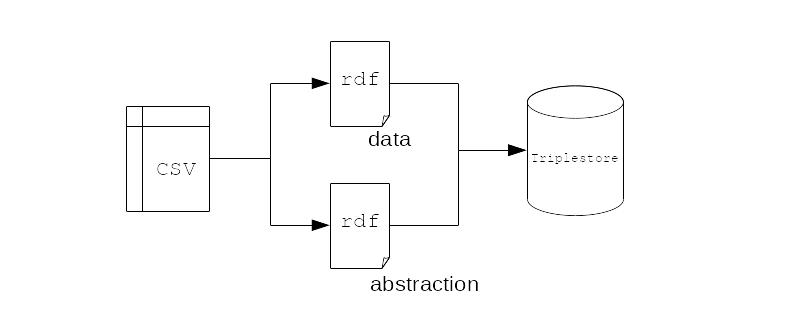

# AskOmics
-------------------------

<br><br><br>
<center>
    <h3>
        AskOmics: a collaborative web platform to Semantic Web for integrating local datasets
        and cross-reference them with external resources
    </h3>    
</center>

<br><br><br><br><br>
<center>
<small>
    Xavier Garnier<sup>1</sup>, Anthony Bretaudeau<sup>1,2</sup>, Fabrice Legeai<sup>1,2</sup>, Anne Siegel<sup>1</sup> and Olivier Dameron<sup>1</sup>
</small>
</center>

<br><br><br>


<small>
1. Inria, Univ Rennes, CNRS, IRISA<br/ >
2. INRA, UMR IGEPP, BIPAA<br/ >

</small>

---

## Table of contents
---------

1. AskOmics 3.2.6
    - Overview
    - Local data integration
    - External resources integration
    - Query builder
    - Query and results management

2. Abstractor 2.0.0
    - Overview
    - How it works?

3. AskOmics 3.3
---

## AskOmics 3.2.6
### Overview
---------------------

--

AskOmics is a web software for data integration (references data and project specific data) and query using semantic web

- Convert multiple data format into rdf triples, and store them into a triplestore

- Query the rdf graph using a user-friendly interface

- Save, relaunch and share queries and results with other users (AskOmics is multi-users)

- AskOmics ecosystem: tools to generate AskOmics compliant files (AskoR, AuReMe), Interoperability with Galaxy

- Cross reference with SPARQL external resources

---


## AskOmics 3.2.6
### Local data integration
---------

AskOmics takes CSV/TSV, GFF3 and BED files as input and convert them into RDF triples. Two kind of triples are generated:

- Data: RDF triples corresponding to the raw data
- Abstraction: RDF triples for data description (entities, attributes and relations)

--



---

## AskOmics 3.2.6
### Local data integration
---------

- Header is used to generate Abstraction
- Rest of the file is the data


---

## AskOmics 3.2.6
### External ressources integration
----------

AskOmics can be used to query external endpoint.

RDF abstraction have to be integrated as an external resources


---


## AskOmics 3.2.6
### Query builder
----------

The AskOmics Query builder is a dynamic graph build with the abstraction. User create a path into the abstraction graph to build a SPARQL query.


---


## AskOmics 3.2.6
### Query builder
----------

Abstraction know where every entity asked are located. Depending on their location, AskOmics will launch the query on:

- The local triplestore
- A distant endpoint
- The Federated query engine ([Corese](https://github.com/wimmics/corese))

The federated query engine will divide the query into subqueries and send them to the concerned endpoint.

---

## AskOmics 3.2.6
### Results and query management
----------

Query are stored and can be re-used.


- Template: the query will be available for the user on the ask page
- Public: the query will be available for every users

--


---


## AskOmics 3.2.6
### Deployment
------------


Easy deployment with [docker-compose](https://github.com/askomics/flaskomics-docker-compose)

---


## Abstractor 2.0.0
### Overview
---------------------

[abstractor](https://github.com/askomics/abstractor)  is a python command line tool to generate an AskOmics abstraction RDF data (SPARQL endpoint or RDF file).

--

Usage :

```bash
# installation
pip install abstractor
# From a SPARQL endpoint
abstractor -s https://sparql.nextprot.org -o nextprot_abstraction.ttl
# from a RDF file
abstractor -s ~/Desktop/data.rdf -t xml -o abstraction.ttl
```

---


## Abstractor 2.0.0
### How it works
---------------------

Abstractor perform 3 queries to get entities, their attributes and relations

- Get entities and relations

```bash
SELECT DISTINCT ?source_entity ?relation ?target_entity
WHERE {
    # Get entities
    ?instance_of_source a ?source_entity .
    ?instance_of_target a ?target_entity .
    # Relations
    ?instance_of_source ?relation ?instance_of_target .
}
```

Results returned are filtered to remove `rdf`, `rdfs`, `owl`, and virtuoso things.


---

## Abstractor 2.0.0
### How it works
---------------------

- Get numeric attributes

```bash
SELECT DISTINCT ?entity ?attribute
WHERE {
    # Get entities
    ?instance_of_entity a ?entity .
    # Attributes
    ?instance_of_entity ?attribute ?value .
    FILTER (isNumeric(?value))
}
```

- Get text attributes

```bash
SELECT DISTINCT ?entity ?attribute
WHERE {
    # Get entities
    ?instance_of_entity a ?entity .
    # Attributes
    ?instance_of_entity ?attribute ?value .
    FILTER (isLiteral(?value))
    FILTER (!isNumeric(?value))
}
```

---

## Abstractor 2.0.0
### Known issue
---------------------

- Some relations are not displayed at the right place


--

<br />


---


## Abstractor 2.0.0
### Known issue
---------------------

- Fix

Create a unique uri for each relation


---


## AskOmics 3.3
### Future version
---------------------

The next version of AskOmics will be [AskOmics 3.3](https://github.com/askomics/flaskomics/projects/6).

Main feature will be to build `UNION` queries with the query builder.


