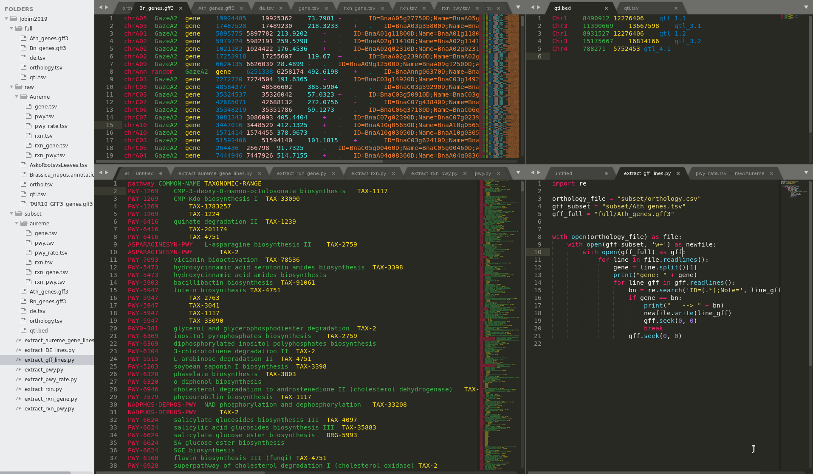
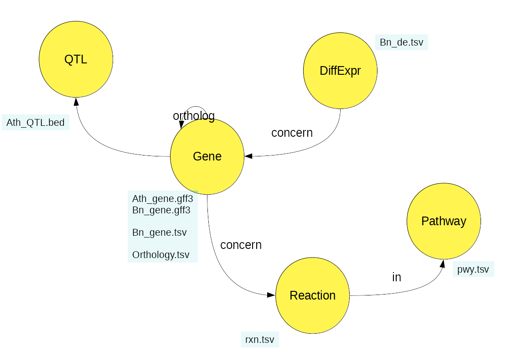

# Jobim 2019
-------------------------

   

    <h3>
        AskOmics, a user-friendly interface to semantic web technologies for integrating local datasets with references resources
    </h3>    

.footnote[Xavier Garnier, Anthony Bretaudeau, Fabrice Legeai, Anne Siegel and Olivier Dameron]

---

## Table of contents
---------

1. AskOmics
    - A nightmare of data
    - How to explore data
    - The semantic web
    - AskOmics as a solution
2. Demo
    - Input Files
    - Questions
    - Demo
3. To go further
    - Other functionalities
    - On going work
    - Take home message(s)

---

## AskOmics
### A nightmare of data
---------

- Big Data: Datasets so **large** or **complex** that traditional data processing is inadequate.

- More than 1500 databases, lack of interoperability, multiple file format

---

## AskOmics
### How to explore data
---------

---

## AskOmics
### How to explore data
---------

- Entity (gene, DE test, Reaction ...)
- Attribute of entity (chromosome, start position, end position ...)
- Relation (a DE test concern a gene, a reaction is describe in a pathway)

Biological questions requires to combine entities from multiple datasets.

---

## AskOmics
### The semantic web
---------

- RDF (resource description framework) can well describe entities and relations
- SPARQL (SPARQL protocol and query language) can be used to extract information

But how to simply use this technologies?

---

## AskOmics
### AskOmics as a solution
---------

AskOmics is a web software for data integration and query using semantic web

- Convert multiple data format into rdf triples, and store them into a triplestore

- Query the rdf graph threw a user-friendly interface

- Save, redo and Share queries and results

---

## Demo
### Input files
---------

- Genetic files
    * *Arabidopsis thaliana* (GFF, TAIR)
    * *Brassica napus* genes (GFF, Bipaa plateforme)
    * Orthology relation (TSV, Chalhoub *et al*, 2014)

- Differential expression
    * Differential expression of *Brassica napus* genes between roots and leaves  (TSV, EdgeR + AskoR)

- Pathway
    * genes reaction and patway data of *Brassica napus* (TSV, Metacyc + AuReMe)

---

## Demo
### Biological questions
---------

- Which genes of *Brassica napus* are more strongly expressed in the roots than in the leaves?

- What are their ortholog in *Arabidospis thaliana*? Are they in a QTL?

- In which biological reactions are the genes obtained involved, and in which metabolic pathways are they involved?

---

## Demo
---------

 

    <h3>
        C4EST PARTI POUR LA <a href="http://localhost:6543">D2MO</a> §§§
    </h3>    

---

## To go further
### On going work
---------

- Support for multiple endpoint (FederetedQueryScaler, wimmics)

- Extend query expressivity (and/or)

- Reach a larger user base
    - Offer a library of templates and queries

- Improve reproducibility and sharing functionalities
    - Save and share queries
    - Automated integration and query with the API

- Refactoring interface
    - API: Flask microframework (python)
    - Task queue: Celery (python)
    - Front: React library (JS)

---

## TGF
### Collaboration
---------

AskOmics users:

- C Bettembourg – IGEPP aphids (D. Tagu)
- A. Evrard – IGEPP rapeseed (M. Jubault)
- M.Aite/C.Frioux/A.Siegel AUREME
- C.Bettembourg - Sanofi
- P. Leroux/F.Lecerf/S.Lagarrigue (Metachick, metabolome)
- IFB project (CIRAD/INRA) - Connecting AskOmics with ”SouthGreen” endpoint
- M. Rousseau/J.Lucas/J.Ferreira de Carvalho/S.Knosp - Rapeseed
- A. Sarniguet,J.Chappat - Rhysophere Colza
- M. Louarn Hematology
- M. Conan Seaweed
- L. Guillot-Cloarec Uniprot/NextProt
- S. Daval (INRA) - Meta-transcriptomics
- BIPAA (Arthropodes)/BBIP (Rapeseed) endpoint in production mode
- M. Wery these CIFRE - Sanofi
- M. Louarn these INSERM-INRIA
- J. Yon - Pegase, INRA
- M. Gonzalez - CGR, Universidad de Chile
- O. Chakoory/E. Forano - INRA

---

## TGF
### Contribution
---------

AskOmics is the result of a strong collaboration between INRA and Inria. It received contributions from:

AskOmics received contributions from :
- Meziane Aite (Inria)
- Arnaud Belcour (intern)
- Charles Bettembourg (postdoc + Sanofi)
- Anthony Bretaudeau (INRA)
- Yvanne Chaussin (intern)
- Olivier Dameron (Univ. Rennes 1)
- Aurélie Evrard (postdoc INRA)
- Olivier Filangi (INRA)
- Xavier Garnier (intern + INRA, then Inria)
- Maël Kerbiriou (intern)
- Fabrice Legeai (INRA)

---

