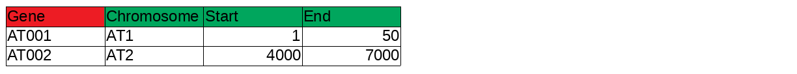

# AskOmics
-------------------------

.footnote[Xavier Garnier, Dyliss team, Inria]

---

## Table of contents
---------

1. Overview

2. Data integration
    - RDF
    - AskOmics's RDF conversion

3. Data query
    - Overview
    - SPARQL
    - AskOmics's SPARQL generation
---


## Overview
---------

AskOmics is a Web tool to integrate datasets and query them through a graphical interface

- Integration: Convert TSV/CSV/GFF Data into RDF triples
- Query: Cross different data sources and extract information

User build a query through an interactive graph ⇒ User don’t need to know semantic web languages (RDF/SPARQL)

---


## Data integration
### RDF
---------

RDF (Resource Description Framework) is a graph model designed to formally describe Web resources and their metadata. It's the language of the semantic web.

RDF is structured into triples: (subject, predicate, object), Subject and predicate are *URI*, Object can be an *URI* or a *litteral*

URI (Uniform Resource Identifier)

http://www.semanticweb.org/user/ontologies/2018/1#AT001

- Subject: a ressource to describe (URI)
- Predicate: a property (URI)
- Object: property's value (Litteral or URI)

--

(AT001, type, gene)

(AT001, chromosome, AT1)

(AT001, start, 1)


---


## Data integration
### RDF
#### Turtle
---------

Turtle (Terse RDF Triple Language) is a RDF syntaxe


```
@prefix : <http://www.semanticweb.org/user/ontologies/2018/1#> .
@prefix rdf: <http://www.w3.org/1999/02/22-rdf-syntax-ns#> .

:AT001 rdf:type :gene .
:AT001 :chromosome :AT1 .
```

---


## Data integration
### AskOmics's RDF conversion

---------

During integration, AskOmics generate 2 kind of data, *Abstraction* and *Content*


- Content is the data
- Abstraction is a description of data (relation between entities, attributes ...)


---

## Data integration
### RDF conversion
#### CSV formatting
---------

- Abstraction generation

AskOmics use the CSV header to create the abstraction



```
@prefix : <http://www.semanticweb.org/user/ontologies/2018/1#> .
@prefix rdf: <http://www.w3.org/1999/02/22-rdf-syntax-ns#> .
@prefix rdfs: <http://www.w3.org/2000/01/rdf-schema#> .

:gene rdf:type :entity .
:gene rdf:type :startPoint .
:gene rdf:type owl:Class .
:gene rdfs:label "Gene" .
```
```
:start rdf:type owl:DatatypeProperty .
:start rdfs:label "start" .
:start rdfs:domain :Gene .
:start rdfs:range xsd:decimal .
```


---

## Data integration
### RDF conversion
#### CSV formatting
---------


```
:transcriptomic rdf:type :entity .
:transcriptomic rdf:type :startPoint .
:transcriptomic rdf:type owl:Class .
:transcriptomic rdfs:label "Transcriptomic" .
```

```
:concerns rdf:type :AskomicsRelation .
:concerns rdf:type owl:ObjectProperty .
:concerns rdfs:label "concerns" .
:concerns rdfs:domain :DifferentialExpression .
:concerns rdfs:range :Gene .
```

```
:dpi rdf:type owl:DatatypeProperty .
:dpi rdfs:label "dpi" .
:dpi rdfs:domain :DifferentialExpression .
:dpi rdfs:range xsd:decimal .
```

---

## Data integration
### RDF conversion
#### CSV formatting
---------


```
:AT001 rdf:type :gene ;
           rdfs:label "AT001" ;
           :chromosome :AT1 ;
           :start 1 ;
           :end 50 .
:AT002 rdf:type :gene ;
           rdfs:label "AT002" ;
           :chromosome :AT2 ;
           :start 4000 ;
           :end 7000 .
```


---


## Data query
### overview
---------


User explore his data using the *Query Builder*


The *Query Builer* is displayed thanks to the *Abstraction*


---


## Data query
### SPARQL
---------

SPARQL (SPARQL Protocol and RDF Query Language) is the language to manipulate (insert, update and query) RDF data


---


## Data query
### SPARQL generation
---------


---


