# AskOmics
-------------------------

<br><br><br>
<center>
    <h3>
        AskOmics: a collaborative web platform to Semantic Web for integrating local datasets
        and cross-reference them with external resources
    </h3>    
</center>

<br><br><br><br><br>
<center>
<small>
    Xavier Garnier<sup>1</sup>, Anthony Bretaudeau<sup>1,2</sup>, Fabrice Legeai<sup>1,2</sup>, Anne Siegel<sup>1</sup> and Olivier Dameron<sup>1</sup>
</small>
</center>

<br><br><br>


<small>
1. Inria, Univ Rennes, CNRS, IRISA<br/ >
2. INRA, UMR IGEPP, BIPAA<br/ >

</small>

---

## Outline
---------

1. AskOmics for RDF data integration and SPARQL query

  - Data integration
  - Query

2. How to query remote endpoints with AskOmics?

3. On-going work

---


## AskOmics
---------

--

AskOmics is a web software for data integration (references data and project specific data) and query using semantic web

- Convert multiple data format into rdf triples, and store them into a triplestore

- Query the rdf graph using a user-friendly interface

- Save, relaunch and share queries and results with other users (AskOmics is multi-users)

- AskOmics ecosystem: tools to generate AskOmics compliant files (AskoR, AuReMe), Interoperability with Galaxy

- **Cross reference with SPARQL external resources**


---


## AskOmics
### Data integration
---------

AskOmics takes CSV/TSV, GFF3 and BED files as input and convert them into RDF triples

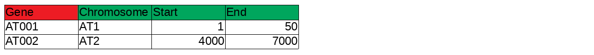


Header describe data, Its use to create *abstraction*, RDF triples that describe data

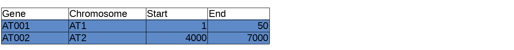

Rest of the file is the *content*. RDF triple are also generated for the data

Each integrated datasets (*content* and *abstraction*) are stored in a named RDF graph

---


## AskOmics
### Data query
---------

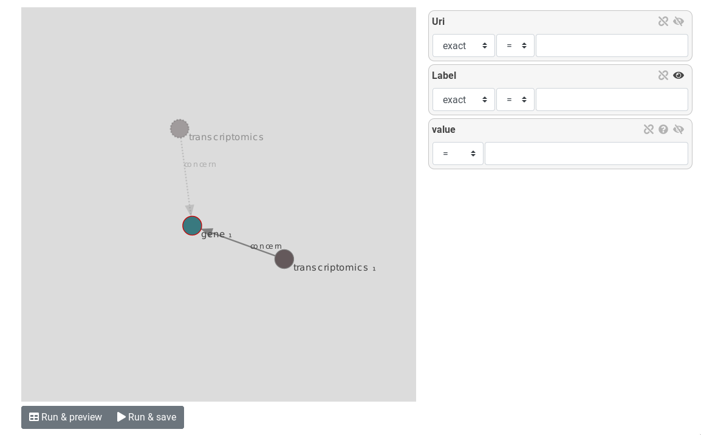


AskOmics graph represent the *Abstraction*. User navigate through the *abstraction* and create a path. This path is converted into a SPARQL query

---


## AskOmics
### Data query
---------

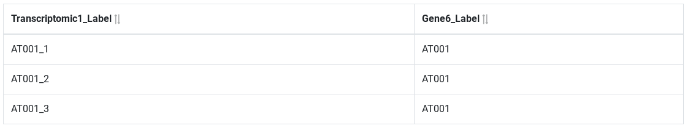


The generated SPARQL query is executed on the *content* and results are displayed to the user

---


## AskOmics
### FAIR
---------

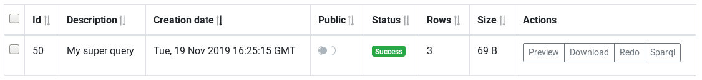


Results are stored on the server. User can download the result as a TSV file, but also repet the query, or edit it with a SPARQL editor

--

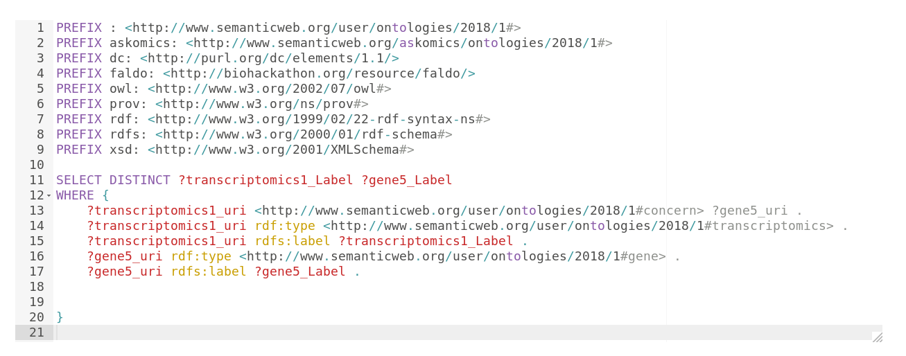


---


## Query remote endpoints
-------------

--

- How to get the description of the remote data to build the graph?

- How to divide the request on the different sources?

--


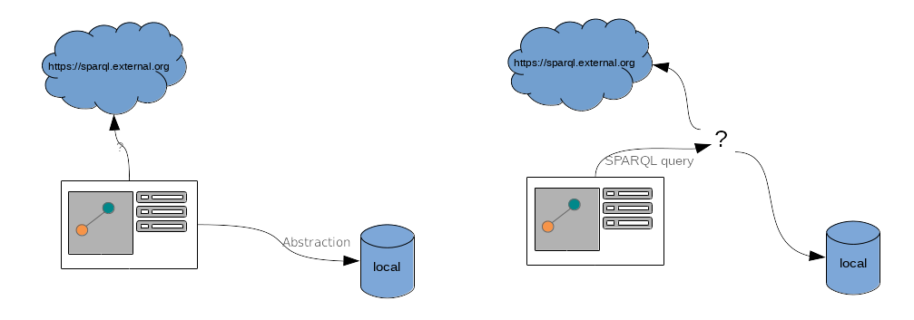


---


## Query remote endpoints
### Abstractor
-------------

[Abstractor](https://github.com/askomics/abstractor)  is a cli tool that generates the *abstraction* of a SPARQL endpoint.

```bash
pip install abstractor
abstractor --help

abstractor -e "https://sparql.nextprot.org" \
           -p "http://nextprot.org/rdf#" \
           -o "nextprot_abstraction.ttl"
```
--

Abstractor explore the endpoint and ask for:

- *entities* (things that have a `rdf:type`)
- *relations* between entities
- *attributes* of the entities (literal things that are linked to the entities)

---


## Query remote endpoints
### Abstractor
-------------

Obtained ttl can be loaded into AskOmics

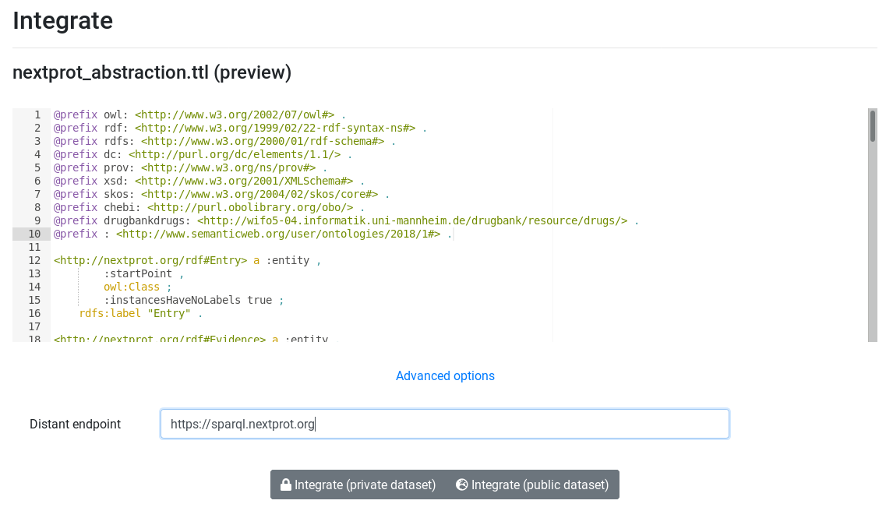

---


## Query remote endpoints
### Abstractor
-------------

Now, AskOmics have the endpoint abstraction and can display entities, relations and attributes


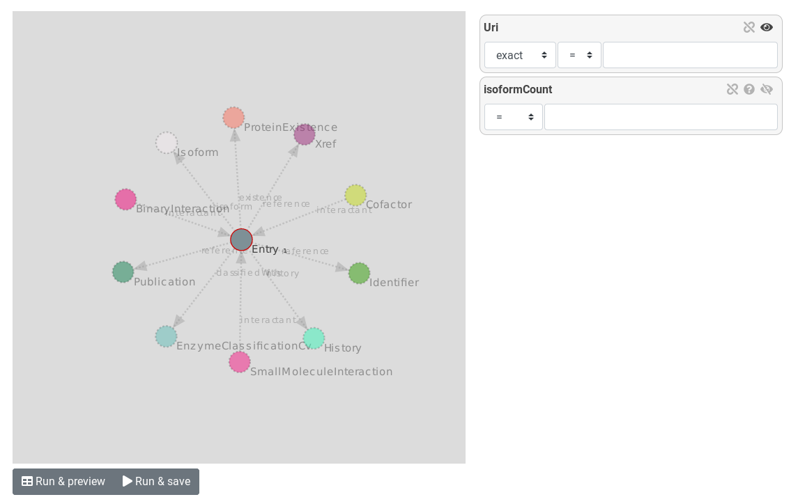

---


## Query remote endpoints
### Abstractor
-------------

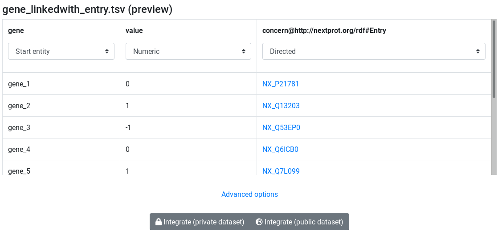


---


## Query remote endpoints
### Abstractor
-------------

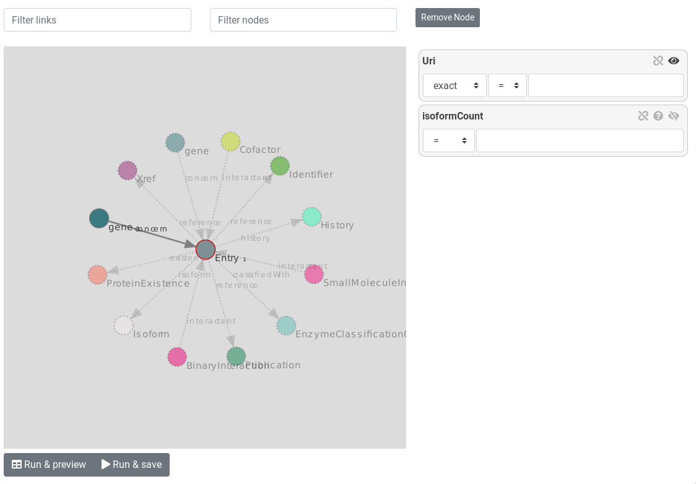

--

How to divide the Query into sub-queries and send them to the right endpoint?

---


## Query remote endpoints
### Federated queries
-------------


--


Two approaches


- Abstraction know where the entities are. Sub-queries can be launched on the right endpoint using the `SERVICE` keyword


--

- Use third-party software to manage the query distribution


---


## Query remote endpoints
### Federated queries
-------------

[Corese](https://github.com/Wimmics/corese) is a Semantic Web Factory (triple store & SPARQL endpoint) implementing RDF, RDFS, SPARQL 1.1 Query & Update

--

- Corese HTTP server
- **Distributed Query Processing**
- SPARQL Inference Rules
- SPARQL Template Transformation Language
- SPARQL approximate search
- SPARQL Property Path extensions
- SPIN Syntax
- RDF Graph as Query Graph Pattern
- SQL extension function


---


## Query remote endpoints
### Federated queries
-------------


```
PREFIX ...

@federate <http://endpoint1/sparql> <https://endpoint2.org> 
@from <http://endpoint1/sparql> <namedgraph1> <namedgraph2>

SELECT DISTINCT ...
WHERE {
    ...
}
```

---


## Query remote endpoints
### Federated queries
-------------

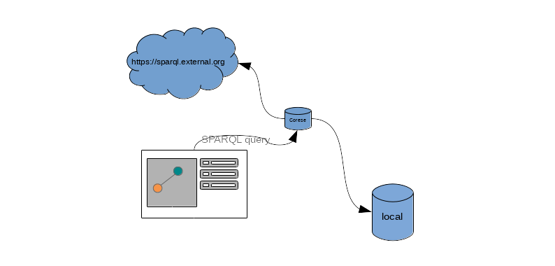


---


## Query remote endpoints
### Federated queries
-------------

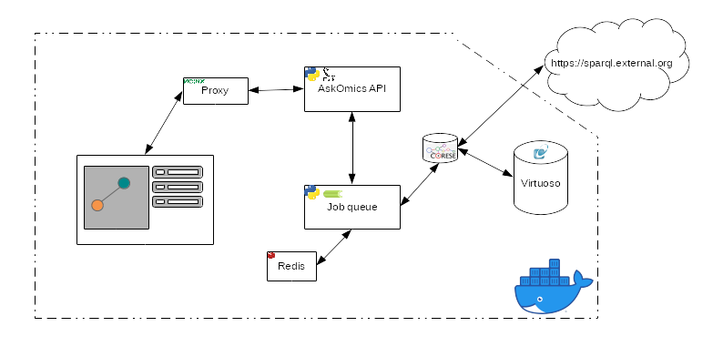

--

Easy deployment with docker and docker-compose: [flaskomics-docker-compose](https://github.com/askomics/flaskomics-docker-compose)


---


## On-going work
-------------


- Improve Abstractor
    - Use Owl when it's present
    - Test on other endpoints (Uniprot, reactome)

- Test Federated queries with `SERVICE`

- Test with complex queries on huge datasets

- Compare the two methods (`SERVICE` vs Corese)

- Simplify navigation of external endpoints with many nodes

---


## Usefull links
---------

- Github repos
    - AskOmics: [askomics/flaskomics](https://github.com/askomics/flaskomics)
    - docker-compose files: [askomics/flaskomics-docker-compose](https://github.com/askomics/flaskomics-docker-compose)

- Docs:
    - AskOmics3: [flaskomics.readthedocs.io](https://flaskomics.readthedocs.io)

- Running instance: [askomics.genouest.org](https://askomics.genouest.org)

- This slides: [xgaia.github.io/askomics/presentation/2](xgaia.github.io/askomics/presentation/2)

- Contact me: [xavier.garnier@irisa.fr](mailto:xavier.garnier@irisa.fr)

